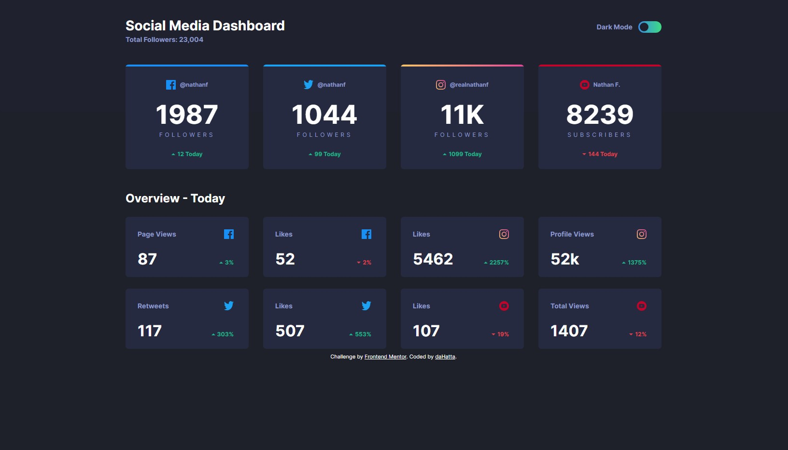

# Frontend Mentor - Social media dashboard with theme switcher solution

This is my solution to the [Social media dashboard with theme switcher challenge on Frontend Mentor](https://www.frontendmentor.io/challenges/social-media-dashboard-with-theme-switcher-6oY8ozp_H).

## Table of contents

- [Overview](#overview)
  - [The challenge](#the-challenge)
  - [Screenshot](#screenshot)
  - [Links](#links)
- [My process](#my-process)
  - [Built with](#built-with)
  - [What I learned](#what-i-learned)
  - [Continued development](#continued-development)
  - [Useful resources](#useful-resources)
- [Author](#author)

## Overview

### The challenge

Users should be able to:

- View the optimal layout for the site depending on their device's screen size
- See hover states for all interactive elements on the page
- Toggle color theme to their preference

### Screenshot



### Links

- Solution URL: [https://github.com/daHatta/fem-social-media-dashboard-with-theme-switcher](https://github.com/daHatta/fem-social-media-dashboard-with-theme-switcher)
- Live Site URL: [https://dahatta.github.io/fem-social-media-dashboard-with-theme-switcher](https://dahatta.github.io/fem-social-media-dashboard-with-theme-switcher)

## My process

### Built with

- Semantic HTML5 markup
- CSS custom properties
- Flexbox
- CSS Grid
- Mobile-first workflow
- Aria - Accessibility
- Javascript

### What I learned

This challenge was a great exercise. I learned more about setting up an efficient markup.
Both types of cards are based on the same markup. Their different appearance is solely based on a single class.

I also used a Aria checkbox variant which differs from the native HTML checkbox.
As it is not recommended I will use the native variant in the future.

```html
<!-- Alternative ARIA: checkbox role -->
<label id="cm-label" class="color-mode__label">Dark Mode</label>
<span
  role="checkbox"
  id="cmPref"
  aria-checked="false"
  tabindex="0"
  aria-labelledby="cm-label"
  class="color-mode__toggle"
>
</span>
```

To set up two different color modes in SASS it was essentiell to nest variables.
This was only to manage by using a certain SassScript expressions.

```css
/* ... */
:root[data-mode="dark"] {
  --clr-bg-body: #{$clr-ntld-very-dark-blue};
  --clr-bg-body-pattern: #{$clr-ntld-very-dark-blue-p};

  --clr-bg-card: #{$clr-ntld-dark-desaturated-blue};

  --clr-fc-primary: #{$clr-ntld-white};
  --clr-fc-secondary: #{$clr-ntld-desaturated-blue};

  --clr-border: #{$clr-ntld-desaturated-blue};
}
/* ... */
```

Setting the preferred color mode via localStorage.

```js
// ...
if (!localStorageItem) {
  modeToSet = window.matchMedia("(prefers-color-scheme: dark)").matches
    ? "dark"
    : "light";
}
// ...
```

### Continued development

It was a nice exercise with a little bit of everything. Next challenge might be one where Javascript is more involved.

### Useful resources

- [A (more) Modern CSS Reset](https://piccalil.li/blog/a-more-modern-css-reset/) - This article by **Andy Bell** helped me to reset websites for browser.
- [A Modern Sass Folder Structure](https://dev.to/dostonnabotov/a-modern-sass-folder-structure-330f) - This article by **Technophile** helped me to build up an architecture for sass.
- [Breaking Change: CSS Variable Syntax](https://sass-lang.com/documentation/breaking-changes/css-vars/) - How to deal with nested variables.
- [Creating a Dark Mode Switcher With CSS and JavaScript](https://www.youtube.com/watch?v=Xk12JtYG8rw) - Great Video about color mode switcher by **Adi Purdila**.
- [Accessible Checkbox](https://developer.mozilla.org/en-US/docs/Web/Accessibility/ARIA/Roles/checkbox_role) - Alternativ checkbox to the native HTML checkbox.
- [Google Fonts](https://fonts.google.com/specimen/Inter) - Font _Inter_ used in this project.

## Author

- Frontend Mentor - [@daHatta](https://www.frontendmentor.io/profile/daHatta)
